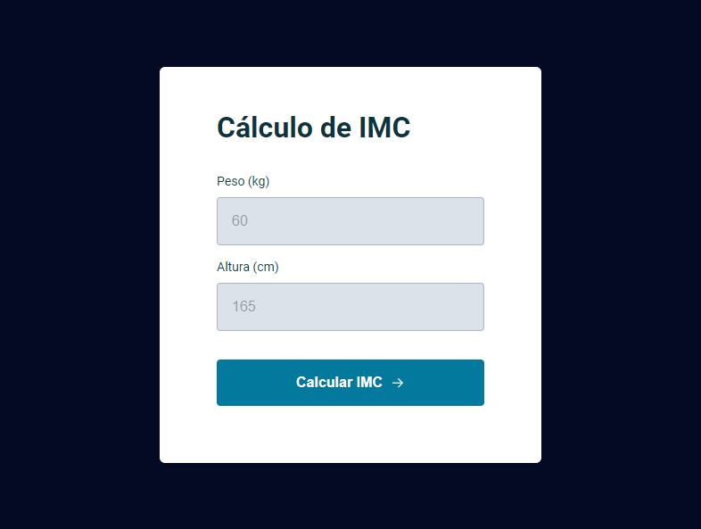
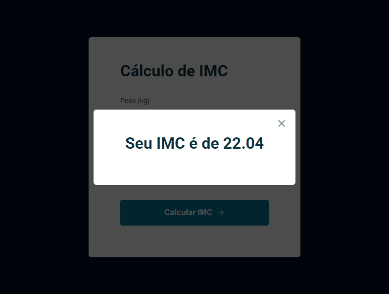
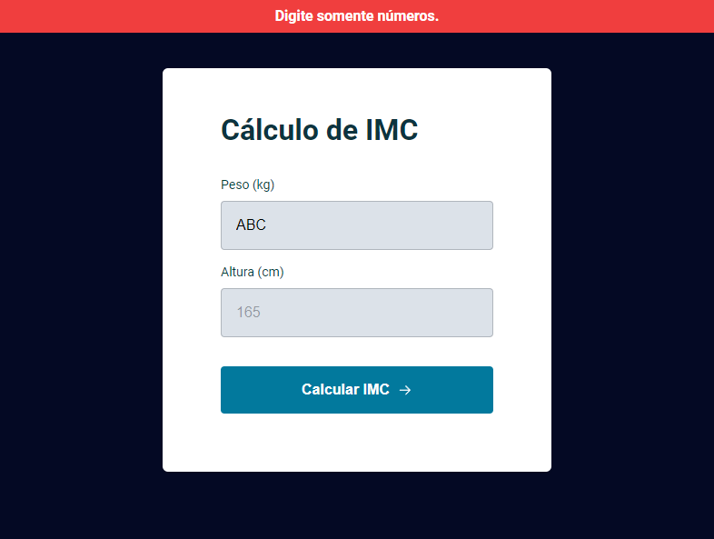

# Calculadora de IMC

> Projeto construído durante as aulas da trilha Explorer da Rocketseat.

    As aulas tiveram o objetivo de utilizar DOM e ES Modules (EcmaScript 6 - ES6) para construir uma aplicação que capta peso e altura do usuário para apresentar seu IMC. Introduzindo e reforçando conhecimentos sobre HTML, CSS, JavaScript, DOM, node, eventos, refatoração de código e separação do JS em módulos.

🔗 [Clique aqui para acessar](https://mbslash.github.io/Calculadora-de-IMC/)

## 💻 Tecnologias

- HTML
- CSS
- JavaScript
- DOM
- Git e Github
- Figma

## 📧 Contato

matheusb.dev@gmail.com